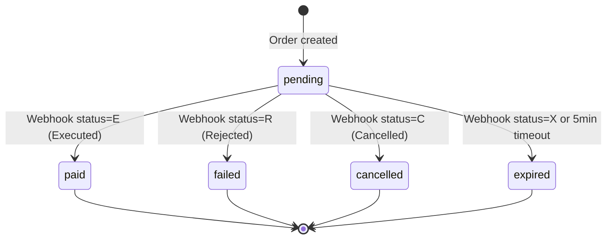
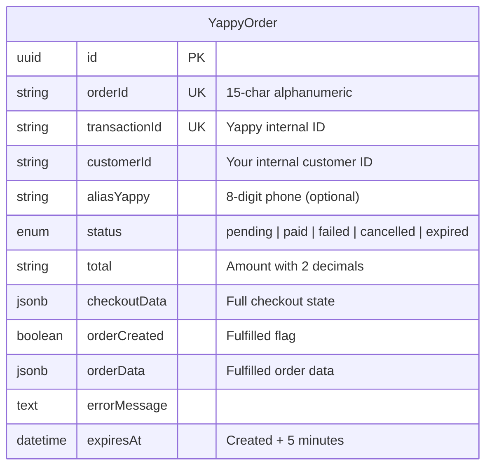

# Database Model

Yappy payments require a database table to:
1. Store pending orders so the IPN webhook can update them
2. Enable status polling by the frontend
3. Provide idempotency (prevent double-processing)
4. Handle expiration logic server-side

---

## Order Lifecycle



## Entity Relationship Diagram



---

## Schema

### Sequelize (TypeScript)

Based on the production Merkapp implementation:

```typescript
import {
  Sequelize,
  DataTypes,
  Model,
  InferAttributes,
  InferCreationAttributes,
  CreationOptional,
} from 'sequelize'

export type YappyOrderStatus = 'pending' | 'paid' | 'failed' | 'cancelled' | 'expired'

export class YappyOrderModel extends Model<
  InferAttributes<YappyOrderModel>,
  InferCreationAttributes<YappyOrderModel>
> {
  declare id: CreationOptional<string>
  declare orderId: string           // 15-char Yappy order ID
  declare transactionId: string     // Yappy's internal transaction ID (unique)
  declare customerId: string        // Your internal customer reference
  declare aliasYappy: CreationOptional<string | null>  // Customer's Yappy phone (if provided)
  declare status: CreationOptional<YappyOrderStatus>
  declare total: string             // e.g. "25.00"
  declare checkoutData: Record<string, unknown>  // Full order data to fulfill on payment
  declare orderCreated: CreationOptional<boolean | null>
  declare orderData: CreationOptional<Record<string, unknown> | null>  // Fulfilled order
  declare errorMessage: CreationOptional<string | null>
  declare expiresAt: Date
  declare createdAt: CreationOptional<Date>
  declare updatedAt: CreationOptional<Date>
}

export function initYappyOrderModel(sequelize: Sequelize): typeof YappyOrderModel {
  class YappyOrder extends YappyOrderModel {}

  YappyOrder.init(
    {
      id: {
        type: DataTypes.UUID,
        defaultValue: DataTypes.UUIDV4,
        primaryKey: true,
      },
      orderId: {
        type: DataTypes.STRING(15),
        allowNull: false,
        unique: true,
        field: 'order_id',
        comment: '15-char alphanumeric Yappy order ID. Unique per transaction.',
      },
      transactionId: {
        type: DataTypes.STRING(255),
        allowNull: false,
        unique: true,
        field: 'transaction_id',
        comment: "Yappy's internal transaction ID.",
      },
      customerId: {
        type: DataTypes.STRING(255),
        allowNull: false,
        field: 'customer_id',
      },
      aliasYappy: {
        type: DataTypes.STRING(8),
        allowNull: true,
        field: 'alias_yappy',
        comment: "Customer's 8-digit Yappy phone number (optional).",
      },
      status: {
        type: DataTypes.ENUM('pending', 'paid', 'failed', 'cancelled', 'expired'),
        defaultValue: 'pending',
        allowNull: false,
      },
      total: {
        type: DataTypes.STRING(20),
        allowNull: false,
        comment: "Total amount as string with 2 decimal places.",
      },
      checkoutData: {
        type: DataTypes.JSONB,
        allowNull: false,
        field: 'checkout_data',
        comment: 'Serialized checkout state to fulfill order on payment confirmation.',
      },
      orderCreated: {
        type: DataTypes.BOOLEAN,
        allowNull: true,
        field: 'order_created',
      },
      orderData: {
        type: DataTypes.JSONB,
        allowNull: true,
        field: 'order_data',
        comment: 'The fulfilled order data, populated after successful payment.',
      },
      errorMessage: {
        type: DataTypes.TEXT,
        allowNull: true,
        field: 'error_message',
      },
      expiresAt: {
        type: DataTypes.DATE,
        allowNull: false,
        field: 'expires_at',
        comment: 'When this order expires. Set to 5 minutes after creation.',
      },
      createdAt: {
        type: DataTypes.DATE,
        field: 'created_at',
      },
      updatedAt: {
        type: DataTypes.DATE,
        field: 'updated_at',
      },
    },
    {
      sequelize,
      modelName: 'YappyOrder',
      tableName: 'yappy_orders',
      timestamps: true,
      underscored: true,
    },
  )

  return YappyOrder
}
```

---

### Prisma schema

```prisma
enum YappyOrderStatus {
  pending
  paid
  failed
  cancelled
  expired
}

model YappyOrder {
  id            String           @id @default(uuid())
  orderId       String           @unique @map("order_id") @db.VarChar(15)
  transactionId String           @unique @map("transaction_id")
  customerId    String           @map("customer_id")
  aliasYappy    String?          @map("alias_yappy") @db.VarChar(8)
  status        YappyOrderStatus @default(pending)
  total         String           @db.VarChar(20)
  checkoutData  Json             @map("checkout_data")
  orderCreated  Boolean?         @map("order_created")
  orderData     Json?            @map("order_data")
  errorMessage  String?          @map("error_message")
  expiresAt     DateTime         @map("expires_at")
  createdAt     DateTime         @default(now()) @map("created_at")
  updatedAt     DateTime         @updatedAt @map("updated_at")

  @@map("yappy_orders")
}
```

---

### SQL migration (PostgreSQL)

```sql
CREATE TYPE yappy_order_status AS ENUM (
  'pending', 'paid', 'failed', 'cancelled', 'expired'
);

CREATE TABLE yappy_orders (
  id               UUID                PRIMARY KEY DEFAULT gen_random_uuid(),
  order_id         VARCHAR(15)         NOT NULL UNIQUE,
  transaction_id   VARCHAR(255)        NOT NULL UNIQUE,
  customer_id      VARCHAR(255)        NOT NULL,
  alias_yappy      VARCHAR(8),
  status           yappy_order_status  NOT NULL DEFAULT 'pending',
  total            VARCHAR(20)         NOT NULL,
  checkout_data    JSONB               NOT NULL,
  order_created    BOOLEAN,
  order_data       JSONB,
  error_message    TEXT,
  expires_at       TIMESTAMPTZ         NOT NULL,
  created_at       TIMESTAMPTZ         NOT NULL DEFAULT NOW(),
  updated_at       TIMESTAMPTZ         NOT NULL DEFAULT NOW()
);

-- Index for webhook lookups (by Yappy orderId)
CREATE INDEX idx_yappy_orders_order_id ON yappy_orders (order_id);

-- Index for status polling (by customerId)
CREATE INDEX idx_yappy_orders_customer_id ON yappy_orders (customer_id);

-- Index for cleanup jobs (by expiry and status)
CREATE INDEX idx_yappy_orders_expires_at ON yappy_orders (expires_at)
  WHERE status = 'pending';
```

---

## Key design decisions

### `checkoutData` (JSONB)

Store the complete checkout state (cart, shipping address, discount code, etc.) before initiating the Yappy payment. When the IPN webhook fires, you can reconstruct and fulfill the order without requiring the customer to still be on the page.

```typescript
const checkoutData = {
  cart: { items: [...], total: '25.00' },
  shippingAddress: { ... },
  discountCode: 'PROMO10',
  customerId: 'cust_123',
}

await YappyOrder.create({
  orderId,
  transactionId,
  customerId,
  checkoutData,
  total: '25.00',
  expiresAt: new Date(Date.now() + 5 * 60 * 1000),
})
```

### Idempotency

The webhook handler should check `status !== 'pending'` before processing:

```typescript
const order = await db.findByOrderId(orderId)
if (order.status !== 'pending') return // Already processed
```

### Auto-expiration

Check expiration in the status endpoint and mark expired orders proactively:

```typescript
if (order.status === 'pending' && new Date() > order.expiresAt) {
  await db.update(orderId, { status: 'expired' })
}
```

### Cleanup job

Run a periodic job (e.g., every 10 minutes) to expire stale orders:

```sql
UPDATE yappy_orders
SET status = 'expired', updated_at = NOW()
WHERE status = 'pending'
  AND expires_at < NOW();
```
