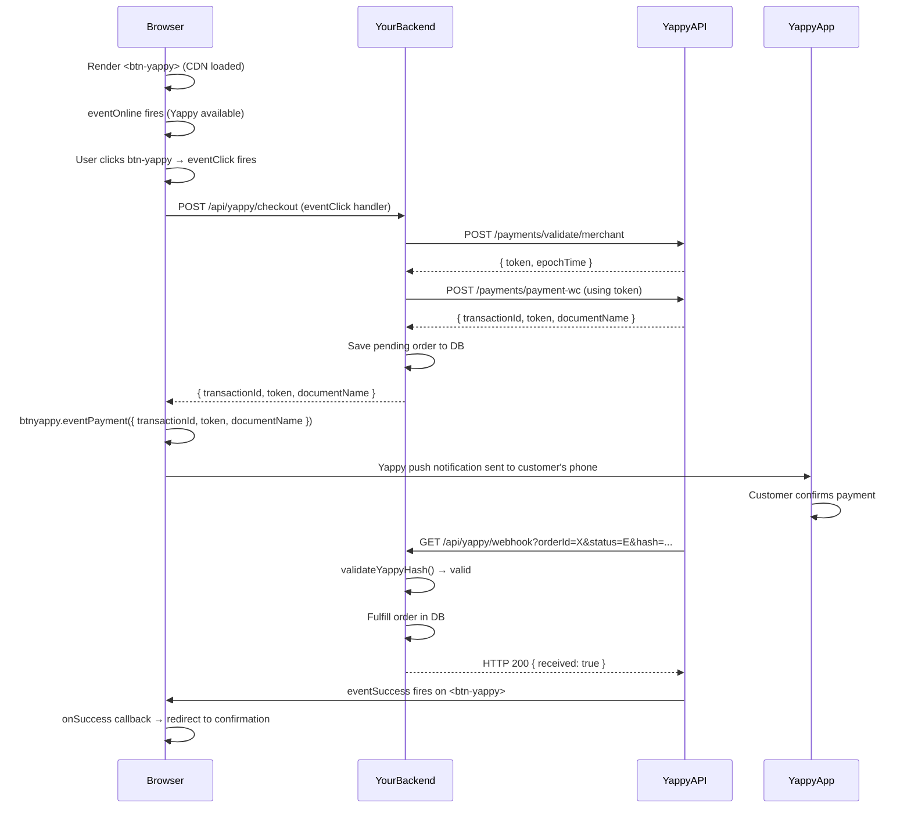
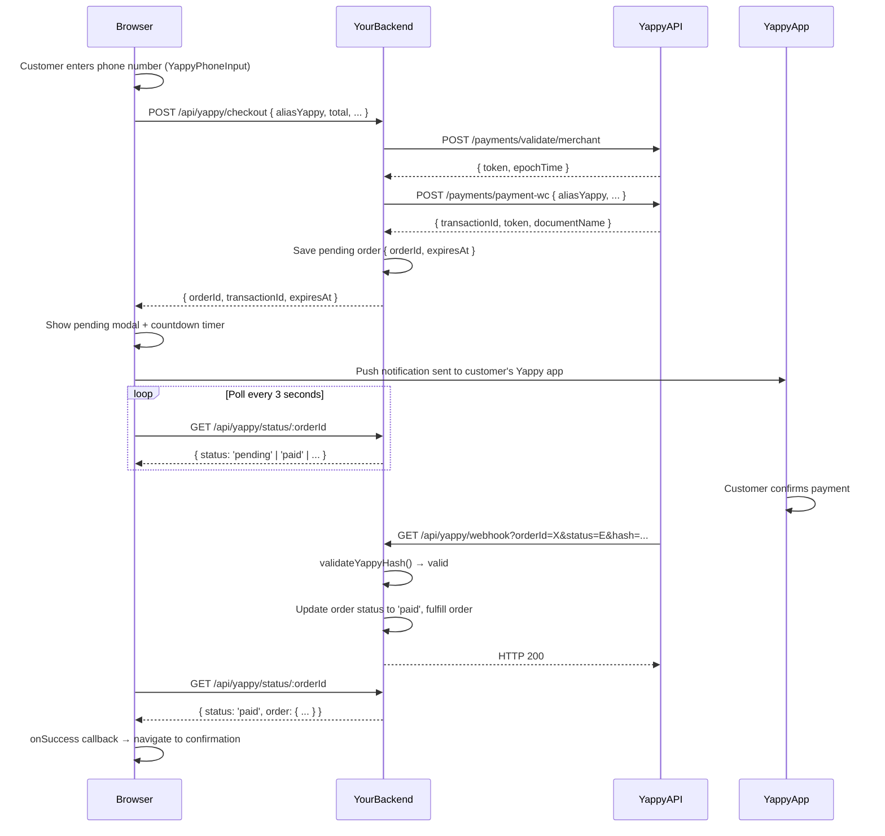
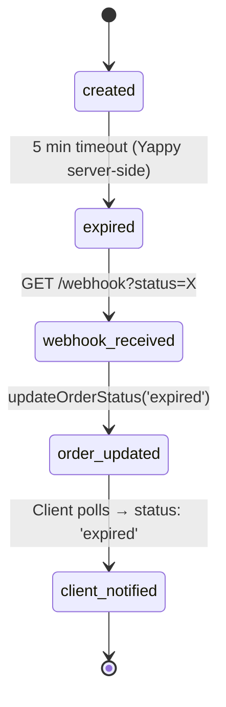

# Payment Flows

Yappy supports two integration approaches. Choose based on your requirements:

| Approach | Best for | UI control | Complexity |
|---|---|---|---|
| **Official Web Component** | Standard integrations, Banco General branding | Low (CDN-managed) | Low |
| **Custom polling flow** | Fully custom UIs, mobile apps, white-label | Full | Medium |

---

## Approach A — Official Web Component

The `<btn-yappy>` Custom Element is provided by Banco General's CDN. It handles the payment UI (QR code or phone push), theming, and result feedback natively.



### Key points

- The browser never directly calls the Yappy API.
- `eventClick` fires when the user taps the button — your handler calls your backend.
- `eventPayment()` activates the Yappy flow inside the web component.
- `eventSuccess` fires when Yappy confirms the payment to the CDN component.
- `eventError` fires if the payment fails.

---

## Approach B — Custom Polling Flow

You build your own UI. The customer enters their Yappy phone number, your backend creates the order, and you poll your backend for the result.



### Key points

- The customer's Yappy push notification is triggered when `aliasYappy` is provided.
- If `aliasYappy` is omitted, the CDN web component shows a QR code instead.
- The browser polls your backend (not Yappy directly) for status updates.
- Your backend gets the authoritative status from Yappy via the IPN webhook.
- `useYappyPendingCheck` orchestrates this entire flow and persists state in `localStorage` to survive page refreshes.

---

## Order Expiration

Yappy orders expire **5 minutes** after creation if not confirmed. The expiry lifecycle:



The client-side timer (`timeLeft`) counts down from 300 seconds and is computed from the `expiresAt` timestamp returned by your backend. If `timeLeft` reaches 0 before the webhook fires, the hook sets status to `'expired'` after a 60-second grace period (in case the webhook is delayed).

---

## Webhook Delivery

Yappy delivers IPN webhooks as **GET requests** (not POST). Always:

1. Validate the `hash` parameter using `validateYappyHash()` before processing.
2. Return HTTP 200 immediately.
3. Process the payment asynchronously (fire-and-forget).
4. Implement idempotency — Yappy may retry the webhook.

Hash algorithm:
```
message = orderId + status + domain
key     = base64decode(CLAVE_SECRETA).split('.')[0]
hash    = HMAC-SHA256(message, key).hexdigest()
```
